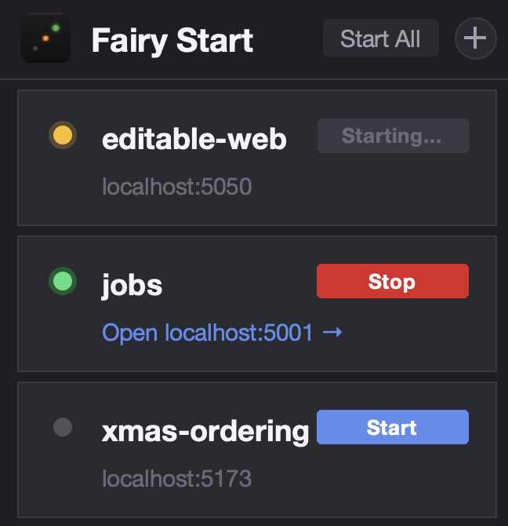

# Fairy Start

**Start and monitor your local dev services from a single window on your Mac.**



---

## Install

```bash
git clone https://github.com/ux-mark/fairy-start.git
cd fairy-start
bash build.sh
```

The build script installs everything it needs (Python, gh CLI) automatically. When it's done, drag **Fairy Start.app** into your Applications folder — or double-click it straight from the repo folder.

> The app is tied to wherever you cloned the repo. If you move the folder, re-run `bash build.sh` to update it.

---

## Add your services

Once the app is open, click **+** to add a GitHub repo:

1. Paste a GitHub URL or `user/repo` shorthand
2. Click **Detect** — Fairy Start reads the repo and suggests a start command automatically
3. Review the fields, then click **Add Service**

Fairy Start clones the repo on first run and pulls the latest on every subsequent start.

---

## That's it

Click **Start** on any service to launch it. When it's up, an **Open →** link appears to open it in your browser. **Start All** starts everything at once.

---

<details>
<summary>Advanced: configuration reference</summary>

Services are stored in `config.toml` at the repo root. You can edit this directly if you prefer, or manage services in bulk.

```toml
[settings]
packages_dir = "packages"   # where repos are cloned (gitignored)

[[package]]
name          = "my-api"
repo          = "user/repo"                  # GitHub shorthand or full https:// URL
branch        = "main"
start_command = "npm install && npm start"
url           = "http://localhost:3000"      # optional — enables health checks + Open button

[[package]]
name          = "another-service"
repo          = "user/other-repo"
branch        = "main"
start_command = "bash -c 'lsof -ti:8080 | xargs kill -9 2>/dev/null; python3 server.py'"
```

**Status indicators**

| Indicator | Meaning |
|---|---|
| Grey ● | Stopped |
| Amber ● Starting… | Launching, or URL not yet responding |
| Green ● Running | Healthy |
| Amber ● Errors | URL returning 5xx |
| Red ● Error | Process exited unexpectedly |

**Error hints**

When a service fails, Fairy Start scans the logs and shows a plain-English fix inline — e.g. port already in use, missing `npm install`, permission errors.

**Prerequisites (handled automatically by build.sh)**

- Homebrew
- Python 3.11+ with `python-tk`
- `gh` CLI (needed for Add via URL and private repos — run `gh auth login` after install)

</details>

---

## License

MIT — see [LICENSE](LICENSE).
